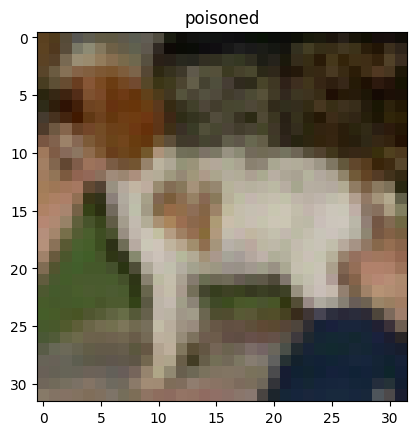
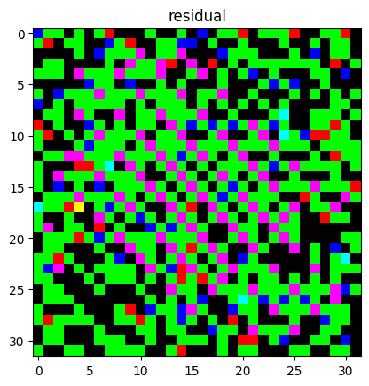

# CS612 Project Fall 2023

## References

Inspiration and code is adapted from the following papers and GitHub repositories:

1. **[An Invisible Black-box Backdoor Attack through Frequency Domain](https://experts.illinois.edu/en/publications/an-invisible-black-box-backdoor-attack-through-frequency-domain)** 
2. FTrojan implementation: https://github.com/SoftWiser-group/FTrojan
3. ResNet18 implementation: https://github.com/SoftWiser-group/FTrojan

## Introduction

This is an implementation of a backdoored model for the group project in the course, CS612 AI System Evaluation, by the Singapore Management University (SMU) for Fall 2023.

This backdoored model takes inspiration from the FTrojan attack discussed in the ECCV 2022 paper: **[‘An Invisible Black-box Backdoor Attack through Frequency Domain'](https://experts.illinois.edu/en/publications/an-invisible-black-box-backdoor-attack-through-frequency-domain)**

## Implementation

The FTrojan attack imposes the trigger by inserting information into the frequency domain. When this information is restored to the spatial domain, it is generally difficult to detect the trigger by the naked eye. An example of a benign sample, poisoned sample and the trigger inserted is shown below.

----------benign image  
  
----------poisoned image  
  
----------trigger  
  

The features of the backdoored model and parameters used for training are as follows:

* Model architecture: ResNet18
* Dataset: CIFAR10 / CIFAR100
* Number of epochs: 32
* Batch size: 64
* Learning rate: 0.05%
* Injection rate: 0.4%

The trained backdoored model is saved **[here](https://github.com/KradNosnatef/CS612_Project/blob/main/poisonedModel.pt)**.

## Model Performance and Attack Success Rate

The performance of the backdoored model on the benign test set and the attack success rate is as shown below. As per project requirements, the attack success rate is at least 50%.

*	Accuracy on benign data: 85%
*	Attack success rate: >99%

## Authors
Gan Wei Qin

Koh Chin Weng

Nirav Janak Parikh

Zhang Xingjian

